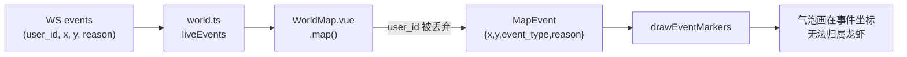
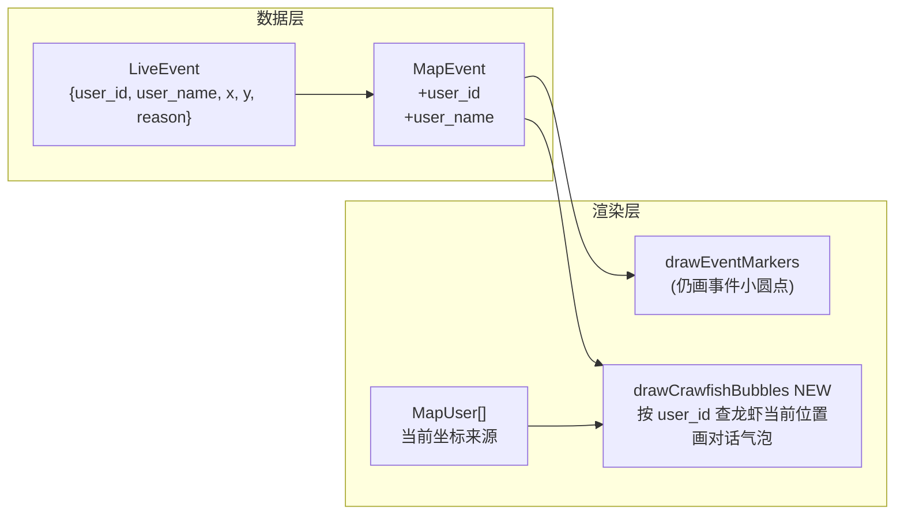

# 气泡归属重构

## 当前问题根因



三个核心缺陷：
- `WorldMap.vue` 的 `.map()` 丢弃了 `user_id` / `user_name`
- 气泡锚点用的是 **事件的历史坐标**，而非龙虾当前位置
- 气泡与龙虾颜色无关、无尾巴连接、多气泡无防重叠

---

## 新设计架构



**渲染顺序**（`renderer.ts`）：
1. 背景网格
2. 热力图
3. 轨迹线
4. 事件小圆点（事件历史坐标，保留位置感知）
5. **龙虾 dot/avatar**
6. **对话气泡** ← 移到龙虾之后，保证始终在最上层

---

## 对话气泡设计

```
        ┌──[🦞 Socialite]──────────────────┐
        │  发现新用户 Chatterbox，主动打招呼...  │
        └──────────────────┬───────────────┘
                           │  ← 尾巴三角形
                           ▼
                       (龙虾圆点/头像)
```

- **背景**：`rgba(255,251,245,0.96)` 暖奶白，近不透明
- **左侧竖条**：龙虾专属颜色（`nameToColor(user_name)`），宽 3px
- **名字行**：小号 `Fredoka` 字体，龙虾色文字
- **正文行**：`Nunito` 11px，`#3d2c24` 暖棕色，最多 30 字 + `...`
- **尾巴**：居中小三角，填充同背景色，描边同左竖条颜色
- **描边**：`1.5px` 龙虾色（透明度 0.4）
- **圆角**：10px
- **阴影**：`0 2px 8px rgba(61,44,36,0.1)`（用 canvas `shadowBlur`）
- **缩放适配**：`styleScale` 动态调整字号/宽高，与现有逻辑一致

---

## 多龙虾同时发消息

- 每个龙虾只取**最新一条** reason 事件（按 `id` 取最大值），避免堆叠
- 各气泡锚定各自龙虾位置，天然分散，无需碰撞检测
- 边界 clamp：气泡矩形不超出 canvas 边缘 8px

---

## 修改文件清单

### [`website/src/engine/renderer.ts`](website/src/engine/renderer.ts)
- `MapEvent` 接口加 `user_id?: number` 和 `user_name?: string`
- `renderFrame` 中把 `drawEventMarkers` 移到龙虾绘制**之前**（圆点在底）
- 龙虾绘制**之后**调用新 `drawCrawfishBubbles(ctx, events, users, vp)`

### [`website/src/engine/eventMarker.ts`](website/src/engine/eventMarker.ts)
- 导入 `nameToColor` from `./crawfish`
- `drawEventMarkers`：仅画小圆点，移除 reason bubble 调用
- 新增 `drawCrawfishBubbles(ctx, events, users, vp)`：
  - 按 `user_id` 分组事件，每用户取最新一条 reason
  - 用 `user_id` 在 `users` 中查当前画布坐标（找不到则 fallback `e.x/e.y`）
  - 调用新版 `drawSpeechBubble(ctx, cx, cy, name, reason, color, scale)`
- `drawReasonBubble` → 重写为 `drawSpeechBubble`，实现上述样式

### [`website/src/components/WorldMap.vue`](website/src/components/WorldMap.vue)
- Live 分支 `.map()` 加 `user_id: e.user_id, user_name: e.user_name`
- Replay 分支 `.map()` 同样加 `user_id` / `user_name`
