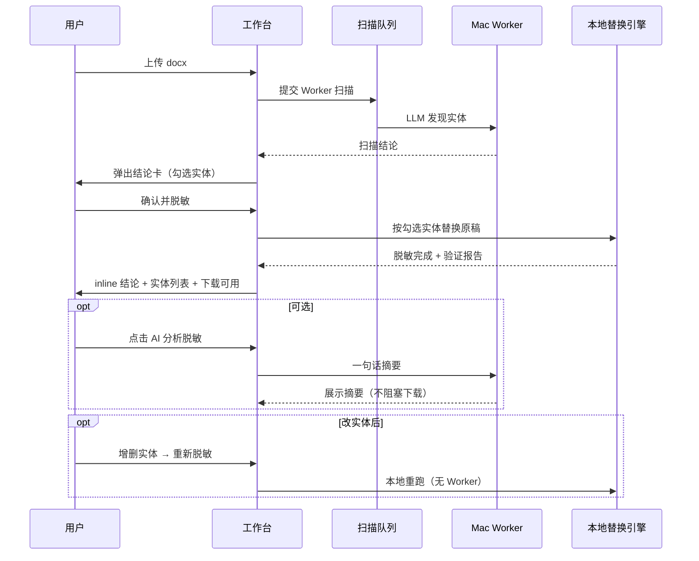

# 文档脱敏 — 工作台重设计

- **日期**: 2026-06-08
- **状态**: 待评审，待实现
- **取代/补充**: `2026-05-31-deid-ui-redesign.md`（IA 与流程以本文件为准）
- **背景**: 产品重心从「词库命中 + 三步向导」转为 **Worker 扫描 → 用户确认实体 → 本地脱敏**；词库包不再是主路径

---

## 1. 已锁定决策

| 项 | 决定 |
|----|------|
| 实体记忆 | 轻量「我的实体」；**手动添加默认勾选记住** |
| Worker 行 ☆ 记住 | **保留**；Worker 发现默认不勾选，用户可主动记住 |
| 来源标签 | **三种**：`智能发现` / `手动` / `已记住`（无预置词库） |
| 页面形态 | **单页工作台**，核心是当前任务 |
| 预置词库 | **无**；无 pack 选择、无规则/白名单 Tab |
| 主路径 | 上传 → **[ 开始扫描 ]** → 结论卡 → **确认并脱敏** → 结束页 → 下载 |
| 重新脱敏 | 改实体后本地重跑，**不调 Worker**，始终基于**原稿** |
| 下载时机 | 脱敏完成**立即可下载** |
| 结论卡确认 | **确认并脱敏**；添加区与确认按钮 **同屏 sticky**（不必滚到底） |
| AI 分析脱敏 | 用户点击；**必须调 Worker 模型**生成一句话；不阻塞下载 |
| Worker 离线 | **[ 开始扫描 ]** 文案改为 **「匹配已记住实体」**；不走 Worker 失败重试 |
| 结论卡退出 | **仅「确认并脱敏」**，无「稍后处理」 |
| 扫描失败 | 重试 → 仍失败 → 提示 → **转手动路径**（F1） |
| 刷新恢复 | 恢复 job + 轮询；`scanned` 未 run → **自动再弹结论卡** |
| 扫描中新建任务 | **不取消**；新任务 **进排队** |
| 全局队列 | 顶栏/侧栏一行：**「1 个任务扫描中 · 你排第 2 位」** |
| 重新脱敏后 AI 摘要 | **S1** 清除，可再点 |
| Worker 中途上线 | Toast 提醒；**重新扫描**降为 Worker 灯旁 **文字链** |
| 历史任务 | **24h**；侧栏列表；点击 → **抽屉**（不占主工作台）；H2 可改实体+重跑 |
| 「我的实体」与 LLM | **M2**：不进 Worker prompt；alias exact 命中并入结论卡 |
| 空实体门槛 | Worker + 已记住均无 → 须手动 ≥1（U1） |
| 扫描触发 | **手动**：上传后点 **[ 开始扫描 ]** |
| 底栏主按钮 | **单一变形主按钮**（扫描 → 重新脱敏）；下载 / AI 次要 |
| Chat Tab | **去掉** |
| 侧栏历史 | **仅 24h**，最多展示最近任务 |

---

## 2. 产品定位

**当前任务工作台** — 审校师一次处理一份 Word 底稿：

- 不是词库管理工具（「我的实体」为次要 Tab）
- 不是多步向导（无 Stepper）
- **无 Chat Tab**
- Worker 负责「发现了什么」；用户负责「要不要脱这些」；引擎负责「替换」

---

## 3. 主流程（Worker 在线）



---

## 4. 主流程（Worker 离线）

1. 上传 docx
2. 点 **[ 匹配已记住实体 ]**（原「开始扫描」变形）— 仅 local alias 命中，**不调 Worker**
3. 弹结论卡（仅有「已记住」/ 手动添加）或空列表 → 手动 ≥1 → **确认并脱敏**
4. 进入 **结束页**（§7）→ 下载 / 重新脱敏 / AI（Worker 离线则 AI 隐藏）

**Worker 离线时不走**扫描失败重试链（P-A13 仅适用于 Worker 在线扫描失败）。

---

## 5. 信息架构

### 5.1 顶栏

| 元素 | 说明 |
|------|------|
| 左 | 产品名 + 「本地处理 · 数据不出服务器」 |
| 中/右 | Tab：**文档脱敏** \| **我的实体** |
| 状态 | Worker 灯（就绪/忙碌/离线）+ **重新扫描** 文字链（降级，非主按钮） |
| 队列 | **全局**：`1 个任务扫描中 · 你排第 2 位`（有排队时显示） |

**移除**：Chat Tab、词库包/规则/白名单 Tab

### 5.2 侧栏（~220px）

- **仅 24h 内**任务；文件名 + 状态 + 剩余清理时间
- 点击 **done** 任务 → **右侧抽屉**（§7.4），不占主工作台
- 「+ 新建任务」；扫描中新建 → 新任务 **进排队**（不取消当前）

### 5.3 主工作台（单页）

1. **上传区** — 拖放 / 文件名
2. **变形主按钮** — 见 §7.3
3. **状态区** — 扫描进度 | **结束页**（§7）| 空
4. **实体列表** — 脱敏完成后可编辑（结论卡内为首次确认）

---

## 6. Worker 扫描结论卡（Modal）

**触发**：Worker 扫描完成且发现 ≥0 个实体建议时弹出。

**形态**：居中 Modal（移动端 Bottom Sheet）；背景 dim；**必须处理或关闭后才能进行其他主操作**。

### 6.1 内容

```
┌─ Worker 扫描结论 ─────────────────────────────┐
│  共发现 12 个可识别主体                        │
│  公司 8 · 人名 3 · 其他 1                      │
│  ⚠ 2 个置信度较低 [展开]                       │
├───────────────────────────────────────────────┤
│  ☑ 中国能源建设股份有限公司   公司  智能发现  ☆ │
│  ☑ 国家电投集团              公司  已记住    ☆ │
│  ...                                            │
│  [ + 手动添加 ]  ☑ 记住（默认勾）                 │
├───────────────────────────────────────────────┤
│              [ 确认并脱敏 → ]  ← sticky 底栏   │
└───────────────────────────────────────────────┘
```

**布局**：列表可滚动；**手动添加 + 确认并脱敏** 固定在 Modal 底部（同屏，无需滚到底）。

**无「稍后处理」**：必须在本 Modal 完成勾选/补实体后点 **确认并脱敏**。

**结论卡数据**：Worker 智能发现 + 「我的实体」alias exact 命中（展示为 **已记住**，非预置词库）。两者均无 → 仅手动添加区，主按钮 disabled 直至 ≥1 实体。

### 6.2 交互规则

| 操作 | 行为 |
|------|------|
| 勾选（默认全选） | 纳入本任务实体列表，脱敏会替换 |
| 取消勾选 | 本任务不替换该项 |
| ☆ 记住 | Worker 行与已记住行均可 ☆；**默认不勾选**；勾选后写入「我的实体」 |
| 手动添加 | 默认勾选记住；添加后立即可见，无需滚到底即可点确认 |
| **确认并脱敏** | sticky 底栏；持久化 → 关 Modal → 本地脱敏 |
| 零实体 / 全不勾选 | disabled（U1） |

**0 实体（Worker + 已记住均无）**：「未发现主体，请手动添加」。

---

## 7. 结束页（脱敏完成后）

主工作台在 `done` 时切换为 **结束页** 布局（非 Modal）。让用户**感知脱敏结论**的多层信息：

### 7.1 结果 Hero（结构化，即时展示）

```
┌─ 脱敏结果 ──────────────────────────────────────┐
│  ✓ 验证通过          [ 下载 docx ]  ← 次要快捷   │
│                                                  │
│  ┌────────┐ ┌────────┐ ┌────────┐ ┌────────┐   │
│  │  12    │ │  156   │ │  8     │ │ 标准   │   │
│  │ 个主体 │ │ 处替换 │ │ 家公司 │ │ 引擎   │   │
│  └────────┘ └────────┘ └────────┘ └────────┘   │
│                                                  │
│  公司 8 · 人名 3 · 其他 1                         │
└──────────────────────────────────────────────────┘
```

| 块 | 内容 | 作用 |
|----|------|------|
| 验证徽章 | 通过绿 / 未通过红 | 能否外发的一眼判断 |
| 数字卡片 | 主体数、替换次数、分型计数 | 量化感知 |
| 引擎标签 | 标准 / 兜底 | 技术信任 |

验证未通过时：Hero 变红 + **残留列表** `<details>`（snippet + 原文片段，最多 5 条）。

### 7.2 替换抽样（可选折叠，默认展开 3 条）

```
替换示例
  中国能源建设股份有限公司 → [公司_1]
  张三 → [姓名_1]
  ...
```

从 `preview` / mapping 取真实 before→after，比数字更直观。

### 7.3 AI 一句话（Worker 模型，用户点击）

- 按钮：**「AI 解读本次脱敏」**（次要，Worker 在线）
- **必须调用 Worker 模型**生成 ≤80 字自然语言句
- 展示在 Hero 下方独立区域；重新脱敏后 **清除**（S1）
- **不阻塞**下载；请求中 Hero/下载仍可用

Prompt 输入：实体列表摘要 + 替换次数 + 验证结果（结构化 metadata）。

### 7.4 实体列表（可编辑）

- 来源标签：**智能发现** / **手动** / **已记住**（三种来源，**无预置词库**）
- × 删除；底部 **+ 添加**（记住默认勾）
- 有改动 → 变形主按钮变为 **重新脱敏**

### 7.5 历史任务抽屉（24h，H2）

侧栏点击 done 任务 → **右侧抽屉 400px**：

- 只读 Hero + 实体列表（可编辑）
- 变形主按钮 **重新脱敏** + **下载**
- 无上传区、无扫描按钮
- 关闭抽屉回当前任务

### 7.6 底栏：变形主按钮

| 状态 | 变形主按钮 | 下载 | AI 解读 |
|------|------------|------|---------|
| draft（已上传） | **开始扫描** / 离线：**匹配已记住实体** | 灰 | 隐藏 |
| scanning | 扫描中… | 灰 | 隐藏 |
| running | 脱敏中… | 灰 | 隐藏 |
| done（无改动） | 灰或隐藏 | **可用** | 可选 |
| done（有改动） | **重新脱敏** | 可用 | 可选 |

下载、AI 始终 **次要按钮**（outline / 文字链），不与主按钮抢视觉。

---

## 8. 「我的实体」Tab（次要）

- 从各任务「记住」沉淀
- 功能：搜索、编辑名称/别名、删除、停用
- **不做**：词库包侧栏、识别规则、白名单（V2 或废弃）
- 作用：跨任务 **记住备查**；**V1 不参与 Worker 扫描 prompt**（M2）
- 例外：扫描阶段可将「我的实体」alias 与文档做 **exact 命中**，结果与 Worker 发现 **合并展示在结论卡**（非 LLM，不计入 M2 的「参与扫描」）

---

## 9. 扫描队列与进度

复用现有 `ScanQueue` + `progress_json`：

| 阶段 | 文案示例 |
|------|----------|
| queued | 排队中（第 N 位） |
| extract | 提取文档… |
| llm | 智能发现 2/5 |
| done (scan) | 扫描完成 → **自动弹**结论卡 Modal |

**刷新恢复（P-A11）**：恢复 job 状态 + 轮询；若 `scanned` 且未 run → **自动再弹结论卡**。

**全局队列文案**：顶栏或侧栏 `N 个任务扫描中 · 你排第 M 位`。

**扫描与脱敏分离**：扫描阶段 `status=scanned`（或新状态 `discovered`）；脱敏阶段 `running` → `done`。

---

## 10. 后端概念变更（非实现细节）

### 11.1 状态机（建议）

```
draft → scanning → scanned → running → done
         (Worker)            (本地引擎)
```

- `scanned`：Worker 扫描完成，实体已写入，**尚未替换**
- 「确认并脱敏」：`scanned` → `running` → `done`
- 「重新脱敏」：`done` → `running` → `done`（保留 `scanned` 的 manual 实体合并逻辑）

### 11.2 API（概念）

| 端点 | 变更 |
|------|------|
| `POST /jobs` | 去掉 `pack_ids` 必填；`use_worker` 默认 true |
| `POST /jobs/{id}/start` | 仅 Worker **扫描**（不 run pipeline） |
| `POST /jobs/{id}/run` | 本地脱敏；接受可选 `entity_ids` 勾选结果 |
| `POST /jobs/{id}/rescan` | 保留：重新 Worker 扫描（V2 入口，主路径不强调） |
| `POST /jobs/{id}/rerun` | 重新脱敏（无 Worker） |
| `POST /jobs/{id}/ai-summary` | Worker 模型生成一句话（**非模板**） |
| `DELETE /jobs/{id}/entities/{eid}` | 删实体 |
| `POST /jobs/{id}/entities` | 手动添加 |

**废弃主路径**：`POST /confirm` 作为用户门槛（可保留为 no-op 或内部合并进 run）。

### 11.3 发现层

- **Worker 扫描**：LLM 发现（队列串行）
- **结论卡合并**：Worker 实体 + 「我的实体」alias exact 命中（**已记住**）
- **M2**：「我的实体」不进 Worker LLM prompt
- **脱敏 / run / rerun**：不调 LLM

---

## 11. 前端文件结构（目标）

```
website/src/
├── views/DeidView.vue                 # 壳：TopBar + 窄侧栏 + Workbench
├── components/deid/
│   ├── DeidWorkbench.vue              # 单页主工作台（新）
│   ├── DeidScanConclusionModal.vue    # Worker 扫描结论卡（新）
│   ├── DeidCompletionHero.vue           # 结束页 Hero + 数字卡（新）
│   ├── DeidReplaceSamples.vue           # 替换抽样（新）
│   ├── DeidHistoryDrawer.vue            # 历史任务抽屉（新）
│   ├── DeidQueueBanner.vue              # 全局队列条（新）
│   ├── DeidEntityList.vue             # 可编辑实体列表（新，替代大表格）
│   ├── DeidEntityAddForm.vue          # 添加实体表单
│   ├── DeidScanProgress.vue           # 扫描进度（已有，复用）
│   ├── DeidJobSidebar.vue             # 收窄
│   ├── DeidTopBar.vue                 # Tab 简化
│   ├── DeidMyEntities.vue             # 原 Library 精简
│   └── DeidDropzone.vue
└── stores/deid.ts                     # 状态机对齐 scanned/running/done
```

**删除**：`DeidWizard.vue`、`DeidStepper.vue`、`DeidStepUpload/Confirm/Export.vue`、`DeidChat.vue`、`DeidLibrary.vue`（改为 `DeidMyEntities.vue`）。

---

## 12. 按钮状态机

见 §7.6 变形主按钮表。

重新脱敏完成后：清除 AI 一句话（S1）。

---

## 13. 用户路径（已决议）

### Worker 在线

| ID | 路径 | 决议 |
|----|------|------|
| P-A1 | 上传 → 扫描 → 结论卡 → 确认并脱敏 → 下载 | ✅ 主路径 |
| P-A4–A7 | 结论卡内勾选/添加/记住 | ✅ |
| P-A8 | ~~稍后处理~~ | **❌ 取消**，不存在此路径 |
| P-A10 | 排队扫描 | ✅ |
| P-A11 | 刷新页面 | ✅ **恢复** job + 轮询 |
| P-A12 | 扫描中新建任务 | ✅ **不取消**；新任务 **进排队** |
| P-A13 | 扫描失败 | ✅ **重试**；仍失败 → 提示 → **转手动路径**（F1） |
| P-A17–A19 | 改实体 / 重新脱敏 / 验证 override 下载 | ✅ |
| P-A20 | 重新脱敏后 AI 摘要 | ✅ **S1** 清除 |

### Worker 离线 / 变化

| ID | 路径 | 决议 |
|----|------|------|
| P-B1–B5 | 手动补充 → 脱敏 | ✅ |
| P-B6 | 任务中 Worker **上线** | ✅ **Toast/Banner 提醒**；当前任务继续；提供 **重新扫描** |
| P-C1 | 扫描中 Worker 断线 | 同 P-A13：重试 → 手动 |

### 导航与历史

| ID | 路径 | 决议 |
|----|------|------|
| P-D2 | 历史 done 任务（24h 内） | ✅ **H2**：可编辑实体、重新脱敏、下载 |
| P-D4 | 刷新 | 同 P-A11 |
| P-E3/E5 | 我的实体 Tab | ✅ **M2** 不参与 LLM 扫描；alias 命中可进结论卡 |

### 边界

| ID | 路径 | 决议 |
|----|------|------|
| P-F1 | Worker + 已记住均无 / 全不勾选 | ✅ **U1** |

### 优化项（已采纳）

| 项 | 决议 |
|----|------|
| 离线扫描按钮 | **匹配已记住实体**，不走失败重试 |
| 变形主按钮 | ✅ |
| 结论卡 sticky 确认 | ✅ |
| 重新扫描降级 | Worker 灯旁文字链 |
| 历史抽屉 H2 | ✅ 24h |
| 全局队列条 | ✅ |
| 刷新恢复 + 再弹 Modal | ✅ |
| AI 摘要 | **Worker 模型**，非模板 |
| 结束页 Hero + 抽样 + AI | ✅ §7.1–7.3 |
| Chat Tab | **去掉** |
| Worker ☆ 记住 | **保留** |

### 仍待决议

（无）

---

## 14. 设计令牌

继续沿用 `deid-tokens.css`（海军蓝主色、审校工作台风）。结论卡 Modal 使用 `--deid-surface` + elevated shadow。

---

## 15. NOT in scope（V1）

| 项 | 理由 |
|----|------|
| 词库包 / 规则 / 白名单 UI | 主路径不依赖 |
| 实体行内编辑 / 占位符编辑 | 删了再加 |
| AI 深度查漏 / 过度脱敏分析 | 用户明确只要一句话摘要 |
| 重新 Worker 扫描主按钮 | 漏网靠手动 + 重新脱敏 |
| 暗色模式 | V2 |
| 多文件批处理 | MVP 外 |

---

## 16. 验收标准

1. 上传后自动（或一键）进入 Worker 扫描，**扫描与脱敏分离**
2. 扫描完成弹出结论卡；**确认并脱敏** 一键进入本地脱敏
3. 脱敏完成 **立即可下载**；实体列表可增删；**重新脱敏不调 Worker**
4. **AI 分析脱敏** 可选、一句话、不阻塞下载
5. 无词库包选择、无三步 Stepper
6. 手动添加默认记住；Worker 实体默认不记住
7. Worker 离线：手动实体 → 脱敏，无 Modal
8. `npm run build` + 现有 deid 测试迁移通过

---

## 17. 决策日志

| 日期 | 决策 |
|------|------|
| 2026-06-08 | 单页工作台；去掉预置词库主路径 |
| 2026-06-08 | 我的实体：手动默认记住（B） |
| 2026-06-08 | 下载：脱敏完立即可用（A） |
| 2026-06-08 | 结论卡：**确认并脱敏**（A） |
| 2026-06-08 | AI 分析：一句话摘要，用户点击，不阻塞 |
| 2026-06-08 | 取消「稍后处理」；结论卡 Worker+词库命中合并展示 |
| 2026-06-08 | P-A11 刷新恢复；P-A12 新建进排队；P-A13 失败转手动 |
| 2026-06-08 | P-B6 上线提醒+可重扫；P-D2 H2；M2；U1；S1 |
| 2026-06-08 | 扫描触发：**手动** |
| 2026-06-08 | 优化批次：离线匹配、变形按钮、结束页 Hero、抽屉、队列条、AI 用模型 |
