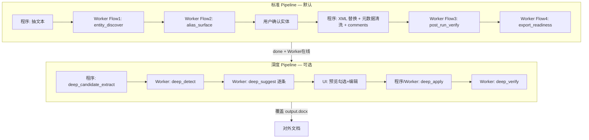

# 脱敏双流水线 + Worker 多流程外发设计

- **日期**: 2026-06-09
- **状态**: 已批准
- **前置**: [`2026-05-31-deid-mvp-design.md`](2026-05-31-deid-mvp-design.md)、[`2026-06-08-deid-mac-worker-llm-design.md`](2026-06-08-deid-mac-worker-llm-design.md)
- **背景**: 审计底稿脱敏后需达到「可对外发布」标准——外部无法识别主体公司；金额保留；泛化依赖 Mac Worker 小模型多流程，程序仅做确定性执行

---

## 1. 产品目标

| 项 | 决定 |
|----|------|
| 成功标准 | Pipeline 出口文档可外发；**外部看不出是哪家公司** |
| 金额 | **保留**，不泛化、不区间化 |
| 标准 Pipeline | 字面主体（公司/人/机构）+ 文档卫生（元数据/文件名） |
| 深度 Pipeline | **可选**；消除身份指纹推断（项目号、客户分类、组织表、高管属性、持股等） |
| Worker | Mac Worker → Ollama（**小模型**，如 qwen3.5:4b-mlx）；语义任务走 Worker，程序做切片与写回 |
| Worker 离线 | 标准可降级下载 + 警告；深度按钮禁用；不建议外发 |

### 1.1 两级就绪模型

| 级别 | 条件 | 含义 |
|------|------|------|
| `standard` | 标准 Flow 1–4 通过 | 名称级匿名，可外发；`readiness.notes` 提示指纹风险 |
| `deep` | 深度 detect→apply→verify 通过 | 身份级匿名，推荐外发 |

---

## 2. 架构总览



**职责划分**

- **Worker**：发现、别名补全、验漏、深度检测/建议、就绪结论
- **程序**：XML 替换、元数据清洗、中性文件名、候选窗口提取、pair 写回、PII 正则兜底

**不做（本 spec）**

- 金额/结论自动改写
- 整段 LLM 重写段落（破坏版式）
- 无 Worker 时的深度脱敏

---

## 3. Job 状态机

```
draft → scanning → scanned → confirmed → running → verifying → done
                                                              ↓ 用户点「深度脱敏」
                                                    deep_scanning → deep_review → deep_applying → deep_verifying → done
```

| 状态 | 含义 |
|------|------|
| `verifying` | 标准 Flow3+4 |
| `deep_scanning` | 程序抽窗口 + Flow deep_detect（+ 可选预跑 suggest） |
| `deep_review` | 预览页等待用户勾选/编辑 |
| `deep_applying` | 写回 pairs，覆盖 output |
| `deep_verifying` | 深度后再验 |

`done` 时 `run_summary.deep_completed` 标记是否完成深度。

---

## 4. Worker Flow 清单

共用 `run_worker_flow(flow_id, ...)`：分块/窗口、队列、429 重试、SSE 进度、离线降级。Prompt 存 `deid_settings`。

### 4.1 标准 Pipeline

#### Flow 1: `entity_discover`（已有，小改）

- **时机**: scan，4000 字 chunk（`DEID_LLM_CHUNK_SIZE`）
- **输出**: `type|名称|别名…`（`llm_parse`）
- **职责**: 字面主体发现

#### Flow 2: `alias_surface`（新增）

- **时机**: Flow1+preset+rule merge 后，用户确认前
- **输入**: chunk + **块内实体子集**（程序预筛 chunk 命中的 canonical，不全贴 81 个实体）
- **输出**: `surface|canonical|文档写法`
- **职责**: 补全简称变体

#### Flow 3: `post_run_verify`（新增）

- **时机**: run + 元数据清洗后
- **输入**: 脱敏后 chunk（不传 mapping 原文）
- **输出**: `leak|类别|片段|说明`；片段 ≤60 字逐字摘录
- **类别**: `entity_leak`、`metadata_leak`

#### Flow 4: `export_readiness`（新增）

- **时机**: Flow3 后，单次调用
- **输入**: Flow3 摘要 JSON ≤1500 字 + 元数据报告 + worker_available
- **输出**: `ready|true|false`、`blocker|…`、`note|…`

### 4.2 深度 Pipeline（小模型优化）

#### 程序: `deep_candidate_extract`（无 LLM）

从脱敏后文本抽候选窗口（≤400 字/`DEID_DEEP_WINDOW_SIZE`）：

- 表头/字段行（客户、项目、主体、股东、高管等）
- 项目模式、人员行（`[姓名_x]`+年份）、组织表行（省/市+数字）

输出 `{window_id, text, char_start, char_end}` 列表。

#### Flow 5: `deep_detect`

- **输入**: **单窗口** ≤400 字（或同类型最多 3 窗打包 ≤1200 字）
- **输出**: `risk|类别|原文逐字摘录|说明`；每窗 ≤3 条；无则 `无`
- **类别**: `project_id`、`client_hint`、`org_fingerprint`、`person_fingerprint`、`listing_fingerprint`
- **max_tokens**: `DEID_DEEP_MAX_TOKENS_DETECT`（默认 256）
- **程序**: 逐字校验摘录；跨窗去重；分配 `risk_id`

#### Flow 6: `deep_suggest`

- **输入**: 单条 risk + 前后文各 300 字（`DEID_DEEP_SUGGEST_CONTEXT`）
- **输出**: `suggest|改写后文本`（单行）
- **max_tokens**: 128
- **UI**: 懒加载逐条；失败则建议为空，用户手写

#### Flow 7: `deep_apply`

- 用户**已编辑**改写 → 程序直接 pair，不调 Worker
- 用户未改 → 复用 suggest 或再调 Flow6
- 写回: 程序 `ReplacementPlan` span 替换；多处匹配由 UI 选择范围

#### Flow 8: `deep_verify`

- 复用 Flow3 prompt + `mode=deep` 补充说明
- 通过后 `readiness.level=deep`

### 4.3 Settings keys

| Key | Flow |
|-----|------|
| `flow_entity_discover_prompt` | 1（默认同 `scan_prompt`） |
| `flow_alias_surface_prompt` | 2 |
| `flow_post_run_verify_prompt` | 3 |
| `flow_export_readiness_prompt` | 4 |
| `flow_deep_detect_prompt` | 5 |
| `flow_deep_suggest_prompt` | 6 |
| `export_filename_mode` | `neutral`（默认）/ `original_stem` |
| `metadata_scrub_label` | 默认 `脱敏工具` |

`prompt_extra` 追加到 Flow 2、3、5。

### 4.4 小模型上下文预算

| 参数 | 标准 scan | 深度 detect | 深度 suggest |
|------|-----------|-------------|--------------|
| 单次输入 | 4000 字 chunk | ≤400 字窗口 | ≤800 字 |
| system prompt | ~1200 字 | ≤500 字 | ≤400 字 |
| max_tokens | 1024 | 256 | 128 |

环境变量:

- `DEID_DEEP_WINDOW_SIZE=400`
- `DEID_DEEP_SUGGEST_CONTEXT=300`
- `DEID_DEEP_MAX_TOKENS_DETECT=256`
- `DEID_DEEP_MAX_TOKENS_SUGGEST=128`

---

## 5. 程序层（确定性）

| 能力 | 时机 |
|------|------|
| 元数据清洗 `scrub_docprops` | run 后 pack 前；清 `core.xml`/`app.xml` 身份字段 |
| 中性文件名 | export 默认 `deid_{job_id}_{YYYYMMDD}_desensitized.docx` |
| `comments.xml` | 纳入 `target_xml_files` |
| PII 正则 | 与 Worker 并行：手机/身份证/信用代码 |

---

## 6. 数据模型扩展

| 字段 | 用途 |
|------|------|
| `deid_jobs.scan_entities_json` | scan 实体快照 |
| `deid_jobs.deep_risks_json` | detect + 用户编辑后的 risk 列表 |
| `deid_jobs.deep_pairs_json` | 实际写回 pairs |
| `verification_json` | 扩展 schema（见 §7） |

不新建子表（单 job 延伸）。

---

## 7. verification_json Schema

```json
{
  "passed": true,
  "worker_available": true,
  "standard": {
    "confirmed_clean": true,
    "metadata_clean": true,
    "pattern_pii_clean": true,
    "worker_entity_clean": true
  },
  "deep": {
    "completed": false,
    "identity_safe": null
  },
  "worker_findings": [],
  "readiness": {
    "ready": true,
    "level": "standard",
    "blockers": [],
    "notes": ["金额与审计结论保留", "未完成深度脱敏时组织指纹可能仍可推断"]
  },
  "flow_summary": {}
}
```

**下载门槛**

| 场景 | 行为 |
|------|------|
| Worker 在线，标准通过 | 可外发（`level=standard`） |
| 深度完成且复检通过 | 可外发（`level=deep`） |
| Worker 离线 | 可下载 + 强制「不建议外发」 |
| 验漏失败 | 软门禁（override_ack） |

---

## 8. API

| 方法 | 路径 | 说明 |
|------|------|------|
| POST | `/jobs/{id}/deep/scan` | 触发深度 detect（+ 可选 suggest 预跑） |
| GET | `/jobs/{id}/deep/risks` | 预览列表 |
| POST | `/jobs/{id}/deep/suggest/{risk_id}` | 单条懒加载 suggest |
| POST | `/jobs/{id}/deep/apply` | `{items: [{risk_id, enabled, original, rewritten}]}` |
| GET | `/jobs/{id}/export` | `filename_mode` 查询参数 |

`run` 结束后自动进入 `verifying`（Flow3+4）。

---

## 9. UI

**标准完成页**

- 验证分块：字面残留 / 元数据 / AI 就绪
- Worker 离线：黄色横幅
- 「下载对外文档」「深度脱敏」（离线禁用）

**深度预览页**

- 列：类别 | 原文 | 建议改写（可编辑）| 勾选
- 建议懒加载；可跳过 AI 手动填
- 进度：`检测 45/87 窗口` → `建议 12/23 条`

**文案**

- 「验证通过」→「名称脱敏验证通过」
- 深度通过 →「身份脱敏验证通过，可对外发布」

---

## 10. 隐私

| Flow | 发送内容 |
|------|----------|
| 1–2 | 原文 |
| 3–4 | 脱敏后文 + 占位符类型 |
| 5–6 | 脱敏后窗口/单条片段 |
| 全程 | 禁止原文写 `app.log`；不传 mapping 给 Worker |

---

## 11. 测试策略

合成 fixture（非真实客户名）：

- 合成集团 + 简称 → Flow2 补 alias
- 脱敏后简称残留 → Flow3 leak
- 元数据 QQ 邮箱 → scrub + 无 metadata_leak
- 项目号 + A+H → deep detect/suggest/apply
- Worker 离线 → 警告 + 深度禁用
- 用户编辑改写 → apply 用编辑文本

---

## 12. 与 MVP 关系

| MVP 设计 | 本 spec |
|----------|---------|
| 仅主体脱敏，金额保留 | 不变 |
| 单 scan LLM | 扩展为 4+4 Worker flow |
| 软门禁 | 保留；增加 readiness level |
| ZIP 导出 mapping | 仍不做；单 docx export |

---

## 13. 验收

- Worker 在线：标准 pipeline 名称级可外发；深度后身份级可外发
- Worker 离线：降级下载有警告；深度不可用
- 小模型：深度 detect 逐窗、suggest 逐条，无单次大块「扫描+改写」
- `pytest tests/test_deid*.py` 全通过
